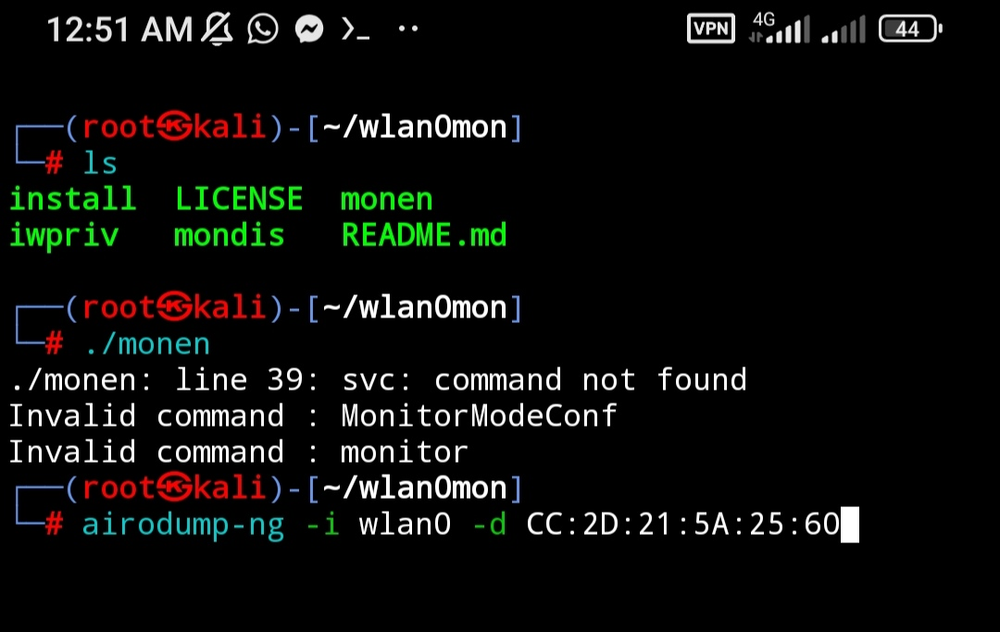

<!--[profile](./r.jpg)-->


### use

``` tsu ```

``` start:- ./monitor ```

``` stop:- ./mondis ```

``` airodump-ng -i wlan0 -d CC:2D:21:5A:25:60 ```

### display show to use this

     nano m
     
     cd && ls &&cd wlan0mon
     ./monen

     nano d
     cd && ls &&cd wlan0mon
     ./mondis

path:---- cd /usr/local/bin


### link

https://github.com/R1punk/wlan0mon

